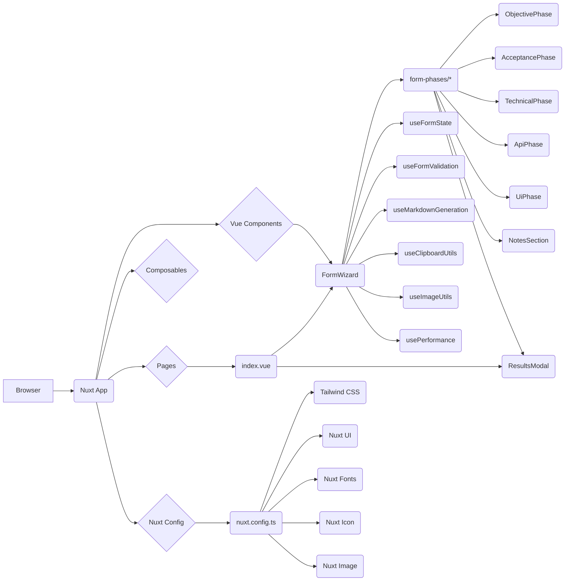

# jira-task-maker - Architecture Documentation

## Project Overview

The Jira Task Maker is a web application built with Nuxt 3 and Vue 3, designed to streamline the process of creating Jira tasks. It provides a step-by-step form wizard that guides users through defining various aspects of a Jira task, including objectives, acceptance criteria, technical specifications, API details, and UI requirements. The application generates a markdown output suitable for Jira.

Key metrics:
- Lines of Code: Approximately 2000+ lines of code across various components and composables.
- Number of Modules: Multiple Vue components and composable functions are used to structure the application.

## Technology Stack

### Languages
- TypeScript (used throughout the project)
- Vue 3 (Composition API with `<script setup>`)

### Frameworks & Libraries
- **Nuxt 3**: ^3.17.6 - Full-stack framework for Vue.js.
- **Vue**: ^3.5.17 - Progressive JavaScript framework for building user interfaces.
- **Vue Router**: ^4.5.1 - Official router for Vue.js applications.
- **Nuxt UI**: ^3.2.0 - UI component library for Nuxt 3, built with Tailwind CSS.
- **Tailwind CSS**: ^3.4.17 - Utility-first CSS framework for rapid UI development.
- **Zod**: ^3.24.0 - TypeScript-first schema declaration and validation library.
- **Heroicons**: ^2.2.0 - MIT-licensed SVG icon sets.
- **Headless UI Vue**: ^1.7.23 - Unstyled, fully accessible UI components for Vue.js.
- **@iconify/vue**: ^5.0.0 - Vue component for Iconify.
- **@nuxt/fonts**: ^0.11.4 - Nuxt module for font optimization.
- **@nuxt/icon**: ^1.15.0 - Nuxt module for icon management.
- **@nuxt/image**: ^1.10.0 - Nuxt module for image optimization.
- **better-sqlite3**: ^12.2.0 - Node.js SQLite3 driver.

### Build Tools
- **Vite**: ^6.3.5 - Build tool used by Nuxt 3.
- **ESBuild**: Used by Vite for fast transpilation.
- **Rollup**: Used by Vite for bundling.

### Testing
- **ESLint**: ^9.0.0 - Pluggable linting utility for JavaScript and TypeScript.
- **Nuxt ESLint config**: `@nuxt/eslint` for Nuxt-specific ESLint configurations.

### Package Manager
- **Bun**: Used for dependency management and running scripts.

### Deployment/Infrastructure Tools
- **Nuxt Nitro**: Server engine for Nuxt 3, used for minification and compression of public assets.

## Architecture Overview

The application follows a **Component-Based Architecture** heavily influenced by the **Nuxt 3 framework**. It utilizes a **Layered Architecture** approach for separation of concerns, with distinct layers for:

- **Presentation Layer**: Vue components (`.vue` files) responsible for UI and user interaction.
- **Composables Layer**: Reusable logic and state management (`composables/` directory).
- **Pages Layer**: Top-level routes for the application (`pages/` directory).
- **Configuration Layer**: Nuxt configuration (`nuxt.config.ts`) and build-related configurations.

The overall structure is organized around features and UI components, with composables providing shared logic and state. Lazy loading is extensively used for performance optimization.

### High-Level Diagram (Conceptual)



### Key Architectural Decisions

- **Component-Based**: UI is built using reusable Vue components.
- **Composition API**: Utilized for all Vue logic in `<script setup>`.
- **Lazy Loading**: Components are dynamically imported to improve initial load performance.
- **Composable Functions**: Shared logic (state management, utilities, performance monitoring) is encapsulated in composables.
- **Nuxt UI**: Used for a consistent and modern UI.
- **Tailwind CSS**: Primary styling utility.
- **Zod**: Used for robust form validation.
- **Performance Optimization**: Focus on bundle splitting, lazy loading, caching, and build optimizations.

## Directory Structure

```
.
├── .nuxt/                  # Nuxt build output (generated)
├── .output/                # Nuxt output directory for production builds
├── assets/
│   └── css/
│       └── main.css        # Global CSS styles, imports Tailwind CSS
├── components/             # Reusable Vue components
│   ├── FormWizard.vue      # Main wizard component, orchestrates form phases
│   └── form-phases/        # Components for individual form steps
│       ├── AcceptancePhase.vue
│       ├── ApiPhase.vue
│       ├── FormWizard.vue  # (Duplicate, likely intended to be in root components)
│       ├── NotesSection.vue
│       ├── ObjectivePhase.vue
│       ├── ResultsModal.vue # Modal for displaying generated markdown
│       └── TechnicalPhase.vue
│       └── UiPhase.vue
├── composables/            # Reusable Vue composable functions
│   ├── useClipboardUtils.ts # Clipboard utility functions
│   ├── useFormState.ts      # Manages form state and step navigation
│   ├── useFormValidation.ts # Handles Zod validation for the form
│   ├── useImageUtils.ts     # Utility functions for image handling (paste, upload)
│   ├── useJsonUtils.ts      # Utility functions for JSON formatting and handling
│   ├── useMarkdownGeneration.ts # Logic for generating markdown from form data
│   ├── useModalState.ts     # Manages global modal state (for ResultsModal)
│   └── usePerformance.ts    # Performance monitoring utilities
├── pages/                  # Application pages (routes)
│   └── index.vue           # Main page with the FormWizard and example preview
├── public/                 # Static assets (e.g., robots.txt, favicon)
├── scripts/                # Utility scripts
│   └── performance-summary.js # Script to display performance optimization summary
├── .env                    # Environment variables (local)
├── .env.example            # Example environment variables
├── .eslintignore           # ESLint ignore file
├── .eslintrc.mjs           # ESLint configuration
├── .gitignore              # Git ignore file
├── bun.lock                # Bun lockfile
├── nuxt.config.ts          # Nuxt configuration file
├── package-lock.json       # npm lockfile (if npm is used)
├── package.json            # Project dependencies and scripts
├── README.md               # Project README file
├── BUILD_FIX_SUMMARY.md    # Documentation on build fixes and UI library changes
└── tsconfig.json           # TypeScript configuration
```

### Directory Descriptions

-   **`.nuxt/`**: Contains Nuxt's internal build artifacts, including generated server and client code. This directory is automatically generated and should not be modified directly.
-   **`.output/`**: The directory where Nuxt outputs the production build artifacts.
-   **`assets/css/`**: Stores global CSS files, including the main Tailwind CSS setup.
-   **`components/`**: Houses reusable Vue components.
    -   **`form-phases/`**: Contains components specific to each step of the Jira task creation form.
-   **`composables/`**: Stores reusable Vue composable functions that encapsulate logic and state.
-   **`pages/`**: Defines the application's routes. `index.vue` is the main entry point.
-   **`public/`**: For static assets that are served directly.
-   **`scripts/`**: Contains utility scripts, such as the performance summary script.
-   **`.env` / `.env.example`**: Environment variable configuration.
-   **`.eslintignore` / `.eslintrc.mjs`**: ESLint configuration files for code linting.
-   **`.gitignore`**: Specifies intentionally untracked files that Git should ignore.
-   **`nuxt.config.ts`**: The main Nuxt configuration file, defining modules, build settings, and optimizations.
-   **`package.json`**: Project metadata, dependencies, and scripts.
-   **`README.md`**: Project description and usage guide.
-   **`BUILD_FIX_SUMMARY.md`**: Documentation detailing build issues and their resolutions, particularly regarding UI library changes.
-   **`tsconfig.json`**: TypeScript configuration for the project.

## Code Organization

### Component-Based Architecture
The application is built using a component-based approach. The `FormWizard.vue` component acts as the central orchestrator, dynamically rendering different form phase components (`components/form-phases/`) based on the current step. State management for the form is handled by the `useFormState` composable.

### Composable Functions
Composables are used extensively to encapsulate reusable logic:
- **`useFormState`**: Manages the current step, form data, and navigation logic.
- **`useFormValidation`**: Integrates Zod for schema validation and provides functions to validate fields and steps.
- **`useMarkdownGeneration`**: Contains the logic to convert form data into Jira-compatible markdown.
- **`useClipboardUtils`**: Provides utility functions for copying text to the clipboard.
- **`useImageUtils`**: Handles image pasting and uploading for UI specifications.
- **`useJsonUtils`**: Utility for formatting JSON strings.
- **`usePerformance`**: Implements performance monitoring for component loads and validation.

### Naming Conventions
- **Files**: PascalCase for Vue components (`FormWizard.vue`), camelCase for composables (`useFormState.ts`) and utility files.
- **Variables/Functions**: camelCase.
- **Interfaces/Types**: PascalCase (`FormState`).

## Layer/Module Breakdown

### Presentation Layer (Components)
- **`components/FormWizard.vue`**:
    - **Location**: `components/FormWizard.vue`
    - **Purpose**: Orchestrates the entire form process, managing steps, rendering current step components, handling navigation, and triggering markdown generation.
    - **Responsibilities**: Step management, component rendering, validation triggering, markdown generation initiation, state synchronization with `useFormState`.
    - **Dependencies**: `useFormState`, `useFormValidation`, `useMarkdownGeneration`, various lazy-loaded form phase components.
    - **Dependents**: `pages/index.vue`.

- **`components/form-phases/*`**:
    - **Location**: `components/form-phases/`
    - **Purpose**: Each component represents a single step in the Jira task creation form.
    - **Responsibilities**: Capturing specific form data, providing input fields, handling local state for that step, and emitting updates to the parent (`FormWizard.vue`) via `v-model`.
    - **Dependencies**: `useFormValidation` (for field-specific errors), `useImageUtils` (for `UiPhase`), `useJsonUtils` (for `ApiPhase`), `useFormState` (for objectives in `AcceptancePhase` and `TechnicalPhase`).
    - **Dependents**: `FormWizard.vue`.

- **`components/form-phases/ResultsModal.vue`**:
    - **Location**: `components/form-phases/ResultsModal.vue`
    - **Purpose**: Displays the generated markdown in a modal, allowing users to copy or download it.
    - **Responsibilities**: Rendering markdown, handling copy-to-clipboard, download functionality, tabbed view for markdown and preview.
    - **Dependencies**: `useClipboardUtils`, `useMarkdownGeneration`.
    - **Dependents**: `pages/index.vue` (via `showModal` and `modalMarkdown` refs).

- **`components/MarkdownPreview.vue`**:
    - **Location**: `components/MarkdownPreview.vue`
    - **Purpose**: Renders markdown content into HTML for preview.
    - **Responsibilities**: Markdown to HTML conversion, applying specific styling for Jira markdown elements.
    - **Dependencies**: None (uses computed property for processing).
    - **Dependents**: `ResultsModal.vue`.

### Composable Layer (Composables)
- **`composables/useFormState.ts`**:
    - **Location**: `composables/useFormState.ts`
    - **Purpose**: Manages the overall state of the form wizard, including the current step, form data, and navigation logic.
    - **Responsibilities**: Holds the `form` object (type `FormState`), manages `step` progression, provides computed properties for navigation state (`isFirstStep`, `isLastStep`, `isCompleted`), and methods for `nextStep`, `previousStep`, `reset`, `editTask`.
    - **Dependencies**: `useFormValidation` (for `FormState` type).
    - **Dependents**: `FormWizard.vue`, `pages/index.vue`.

- **`composables/useFormValidation.ts`**:
    - **Location**: `composables/useFormValidation.ts`
    - **Purpose**: Defines the Zod schema for form validation and provides validation logic.
    - **Responsibilities**: Schema definition (`formSchema`), field-level validation (`validateField`, `getFieldError`), step-level validation (`validateCurrentStep`), and UI-specific error handling.
    - **Dependencies**: `zod`.
    - **Dependents**: `FormWizard.vue`.

- **`composables/useMarkdownGeneration.ts`**:
    - **Location**: `composables/useMarkdownGeneration.ts`
    - **Purpose**: Handles the conversion of structured form data into Jira-compatible markdown.
    - **Responsibilities**: Formats objectives, acceptance criteria (Gherkin), technical steps, API specifications, UI specifications, and additional notes into markdown. Includes logic for handling optional fields and file references.
    - **Dependencies**: `useClipboardUtils`, `FormState` type.
    - **Dependents**: `FormWizard.vue`.

- **`composables/useClipboardUtils.ts`**:
    - **Location**: `composables/useClipboardUtils.ts`
    - **Purpose**: Provides a utility function to copy text to the clipboard.
    - **Responsibilities**: Implements clipboard API for modern browsers and a fallback for older ones.
    - **Dependents**: `ResultsModal.vue` (via `useModalState`), `useMarkdownGeneration`.

- **`composables/useImageUtils.ts`**:
    - **Location**: `composables/useImageUtils.ts`
    - **Purpose**: Handles image-related operations for UI specifications, such as pasting and uploading.
    - **Responsibilities**: `handleImagePaste`, `handleImageUpload`, `triggerImageUpload`, `clearImage`, `getImagePreviewUrl`, `getImageFileName`, `isImageFile`.
    - **Dependencies**: `useToast` (from Nuxt UI, implicitly).
    - **Dependents**: `UiPhase.vue`.

- **`composables/useJsonUtils.ts`**:
    - **Location**: `composables/useJsonUtils.ts`
    - **Purpose**: Provides utility functions for formatting JSON strings and handling JSON input in textareas.
    - **Responsibilities**: `formatJson`, `handleJsonInput`.
    - **Dependents**: `ApiPhase.vue`.

- **`composables/usePerformance.ts`**:
    - **Location**: `composables/usePerformance.ts`
    - **Purpose**: Implements performance monitoring utilities.
    - **Responsibilities**: `markStart`, `markEnd`, `getMetrics`, `logBundleSize`, `measureComponentLoad`.
    - **Dependents**: `FormWizard.vue`.

- **`composables/useModalState.ts`**:
    - **Location**: `composables/useModalState.ts`
    - **Purpose**: Manages the global state for modals, specifically the `ResultsModal`.
    - **Responsibilities**: Provides reactive references for `showModal`, `modalMarkdown`, `modalCopied`, and functions to control the modal state (`openModal`, `closeModal`, `setModalCopied`).
    - **Dependents**: `pages/index.vue`.

### Pages Layer
- **`pages/index.vue`**:
    - **Location**: `pages/index.vue`
    - **Purpose**: The main application page. It sets up the overall layout, including the header, footer, and the lazy-loaded `FormWizard`. It also manages the state for the `ResultsModal` and handles its interactions (download, copy, reset, edit).
    - **Responsibilities**: SEO meta tags, page layout, modal state management, event handling for modal actions, providing `onFormComplete` handler to `FormWizard`.
    - **Dependencies**: `LazyFormWizard`, `LazyResultsModal`, `useModalState`.
    - **Dependents**: None (it's the root page).

### Configuration Layer
- **`nuxt.config.ts`**:
    - **Location**: `nuxt.config.ts`
    - **Purpose**: Nuxt application configuration.
    - **Responsibilities**: Defines global CSS, modules (`@nuxt/eslint`, `@nuxt/fonts`, `@nuxt/icon`, `@nuxt/image`, `@nuxtjs/tailwindcss`), performance optimizations (experimental, modern, Vite, Nitro), route rules (prerendering, caching), and other Nuxt-specific settings.
- **`tsconfig.json`**: TypeScript configuration for the project.
- **`.eslintrc.mjs`**: ESLint configuration for code linting.
- **`.gitignore`**: Specifies files and directories to be ignored by Git.
- **`package.json`**: Project metadata, dependencies, and scripts.
- **`bun.lock`**: Bun lockfile for dependency management.

## Architecture Pattern

The project primarily uses a **Component-Based Architecture** within the **Nuxt 3 framework**. Nuxt's file-based routing (`pages/`) and auto-imports for components and composables simplify the structure. The architecture can be described as:

- **Layered**: Clear separation between presentation (components), logic/state (composables), and routing (pages).
- **Modular**: Features are broken down into smaller, reusable components and composables.
- **Progressive**: Lazy loading and `ClientOnly` components ensure that only necessary code is loaded initially, improving performance.
- **Reactive**: Vue's reactivity system is used extensively for state management and UI updates.

## Data Flow

### Request Flow (Client-side)

1.  **User Interaction**: User interacts with the `FormWizard.vue` components.
2.  **State Update**: User input updates the `form` ref within `useFormState`.
3.  **Validation**: `validateCurrentStep` and `canProceed` functions in `useFormValidation` are called to check the validity of the current step's data.
4.  **Navigation**: If valid, `nextStep` or `previousStep` in `useFormState` is called, updating the `step` ref. This triggers the rendering of the next/previous component via `currentStepComponent` in `FormWizard.vue`.
5.  **Markdown Generation**: When the user reaches the last step and clicks "Generate Jira Task", `handleNextStep` in `FormWizard.vue` calls `generateMarkdown` from `useMarkdownGeneration`.
6.  **Modal Display**: The generated markdown is passed to `pages/index.vue` via `onFormComplete` (provided by `pages/index.vue` and injected into `FormWizard.vue`), which then updates `modalMarkdown` and sets `showModal` to `true`, displaying the `ResultsModal.vue`.
7.  **Modal Actions**: User interacts with buttons in `ResultsModal.vue` (copy, download, reset, edit), which emit events handled by `pages/index.vue`.

### Data Transformation

-   **Markdown Generation**: `useMarkdownGeneration.ts` is responsible for transforming the structured `FormState` object into a markdown string.
-   **JSON Formatting**: `useJsonUtils.ts` formats JSON payloads for API specifications.
-   **Image Handling**: `useImageUtils.ts` handles converting uploaded/pasted images into File objects and generating preview URLs.

### State Management

-   **`useFormState`**: Centralized management of the entire form's data (`form` ref) and the current step (`step` ref). This composable acts as a global state manager for the form wizard.
-   **`useModalState`**: Manages the global state for the `ResultsModal`, allowing components to open/close it and update its content.
-   **Local Component State**: Individual form phase components manage their own internal state where necessary (e.g., adding multiple objectives or acceptance criteria conditions).

## Feature-to-Code Mapping

### Jira Task Creation Form

-   **Entry Point**: `pages/index.vue` renders the `LazyFormWizard`.
-   **Orchestration Logic**: `components/FormWizard.vue` manages the overall flow, step progression, and component rendering.
-   **State Management**: `composables/useFormState.ts` holds the form data and current step.
-   **Validation**: `composables/useFormValidation.ts` provides schema and validation logic.
-   **Form Phases**: Each step is a component in `components/form-phases/`, e.g., `ObjectivePhase.vue`, `AcceptancePhase.vue`, `TechnicalPhase.vue`, `ApiPhase.vue`, `UiPhase.vue`.
-   **Output Generation**: `useMarkdownGeneration.ts` converts the form data to markdown.
-   **Displaying Output**: `pages/index.vue` manages the `ResultsModal.vue` to show the generated markdown.

### Preview Example

-   **Entry Point**: Button click in `pages/index.vue`.
-   **Logic**: Sets sample markdown content to `modalMarkdown` ref.
-   **Display**: Triggers `showModal` to `true`, which renders the `LazyResultsModal`.

## API Structure

The application is primarily client-side and does not expose a backend API for task creation. It focuses on client-side form management and markdown generation.

-   **Internal API**: The `useFormState` composable provides an internal API for managing form data and steps.
-   **External API Interaction**: The `ApiPhase.vue` component allows users to define API specifications, including endpoint URLs, HTTP methods, request, and response payloads. This data is then used in the markdown generation.

## Database/Data Access

The application does not interact with a persistent database. All data is managed client-side in the Vue reactivity system (`ref` and `computed` properties).

## Dependencies

### External Dependencies
- **Nuxt 3**: Core framework.
- **Vue 3**: UI framework.
- **Nuxt UI**: UI component library.
- **Tailwind CSS**: Styling.
- **Zod**: Schema validation.
- **Heroicons**: SVG icons.
- **Headless UI Vue**: Unstyled UI components.
- **Iconify**: Icon management.
- **Bun**: Package manager and runtime.
- **Vite**: Build tool.
- **ESBuild**: Transpilation.
- **Rollup**: Bundling.
- **@iconify-json/heroicons**: Heroicons icon set for Iconify.
- **@nuxt/fonts**: Font optimization.
- **@nuxt/icon**: Icon module.
- **@nuxt/image**: Image optimization.
- **@nuxtjs/tailwindcss**: Tailwind CSS integration for Nuxt.
- **@tailwindcss/postcss**: PostCSS plugin for Tailwind CSS.
- **path-browserify**: Polyfill for Node.js `path` module in browsers.
- **url**: Polyfill for Node.js `url` module in browsers.
- **better-sqlite3**: Used for database operations, though not directly utilized in the core form logic.

### Internal Dependencies
- **Composables**: `useFormState`, `useFormValidation`, `useMarkdownGeneration`, `useClipboardUtils`, `useImageUtils`, `useJsonUtils`, `useModalState`, `usePerformance`. These are heavily used across components.
- **Components**: `FormWizard.vue` depends on various `form-phases/*` components and `ResultsModal.vue`. `pages/index.vue` depends on `FormWizard.vue` and `ResultsModal.vue`. `ResultsModal.vue` depends on `MarkdownPreview.vue`.

## Configuration

### Configuration Management
- **`nuxt.config.ts`**: The primary configuration file for Nuxt, Tailwind CSS, Nuxt UI, fonts, images, and build optimizations.
- **`.env` / `.env.example`**: For managing environment-specific variables.

## Testing

### Test Organization
- **ESLint**: Used for code linting (`.eslintrc.mjs`).
- **TypeScript**: Type checking is performed via `nuxt typecheck` script.
- **No explicit testing framework (e.g., Vitest, Jest) is configured or used in the provided files.**

## Build & Deployment

### Build Process
- **Development**: `bun run dev` starts the development server.
- **Production Build**: `bun run build` creates an optimized production build in the `.output/` directory.
- **Analysis Build**: `bun run build:analyze` builds the project with bundle analysis enabled (controlled by `ANALYZE=true` environment variable).
- **Preview**: `bun run preview` serves the production build locally.
- **Generate**: `bun run generate` performs a static site generation (SSG).

### Build Artifacts
- `.nuxt/`: Nuxt internal build artifacts.
- `.output/`: Production build output.
- `dist/`: Potentially used for static site generation output.

### Deployment
- The application is designed to be deployable as a static site (via `nuxt generate`) or a server-rendered application (via `nuxt build`).
- **Nitro optimizations**: `minify: true`, `compressPublicAssets: true` are configured for production builds.
- **Caching**: `routeRules` in `nuxt.config.ts` configure aggressive caching for static assets (`/_nuxt/**`).

## Development Workflow

### Setup
1.  **Clone**: `git clone <repository-url>`
2.  **Navigate**: `cd jira-task-maker`
3.  **Install Dependencies**: `bun install`
4.  **Start Dev Server**: `bun run dev`
5.  **Access**: Open `http://localhost:3000`

### Common Tasks
- **Linting**: `bun run lint` / `bun run lint:fix`
- **Type Checking**: `bun run typecheck`
- **Cleaning Build Artifacts**: `bun run clean`
- **Bundle Analysis**: `bun run build:analyze`

## Key Design Decisions

-   **Lazy Loading Components**: Crucial for performance, ensuring only necessary code is loaded.
-   **Composable Architecture**: Promotes code reuse and separation of concerns for state management and utility functions.
-   **Zod for Validation**: Provides strong, declarative validation integrated with TypeScript.
-   **Nuxt UI & Tailwind CSS**: Leveraged for rapid UI development and consistent styling.
-   **Performance Focus**: Explicit optimizations in `nuxt.config.ts` and the use of `usePerformance` composable highlight a commitment to performance.
-   **Decoupled Modal State**: `useModalState` provides a global way to manage the `ResultsModal`.
-   **Build Fix Summary**: `BUILD_FIX_SUMMARY.md` indicates a history of addressing build compatibility issues, particularly with Nuxt and Tailwind CSS versions.

## Future Considerations

-   **Service Worker**: For potential offline functionality.
-   **Real User Monitoring**: Integration for production performance tracking.
-   **Template System Enhancement**: More advanced template management.
-   **CI/CD Integration**: Automating builds, tests, and deployments.

## Analysis Guidelines

The analysis was performed by examining the provided file structure, dependencies in `package.json` and `bun.lock`, Nuxt configuration, and the content of key Vue components and composable functions. Patterns like lazy loading, component composition, and the use of specific libraries (Nuxt UI, Zod, Tailwind CSS) were identified. The `BUILD_FIX_SUMMARY.md` file provided valuable context on past architectural decisions and dependency management. The `scripts/performance-summary.js` file also offered insights into the project's performance goals and implemented optimizations.

```json
{
  "name": "jira-task-maker",
  "private": true,
  "type": "module",
  "scripts": {
    "build": "nuxt build",
    "build:analyze": "ANALYZE=true nuxt build",
    "dev": "nuxt dev",
    "dev:host": "nuxt dev --host",
    "generate": "nuxt generate",
    "preview": "nuxt preview",
    "postinstall": "nuxt prepare",
    "lint": "eslint .",
    "lint:fix": "eslint . --fix",
    "clean": "rm -rf .nuxt .output dist",
    "typecheck": "nuxt typecheck"
  },
  "dependencies": {
    "@nuxt/eslint": "1.5.2",
    "@nuxt/fonts": "0.11.4",
    "@nuxt/icon": "1.15.0",
    "@nuxt/image": "1.10.0",
    "better-sqlite3": "^12.2.0",
    "eslint": "^9.0.0",
    "nuxt": "^3.17.6",
    "tailwindcss": "^3.4.17",
    "typescript": "^5.6.3",
    "vue": "^3.5.17",
    "vue-router": "^4.5.1",
    "zod": "^3.24.0"
  },
  "devDependencies": {
    "@headlessui/vue": "^1.7.23",
    "@heroicons/vue": "^2.2.0",
    "@iconify-json/heroicons": "^1.2.2",
    "@nuxt/devtools": "latest",
    "@nuxtjs/tailwindcss": "^6.14.0",
    "@tailwindcss/postcss": "^4.1.11",
    "path-browserify": "^1.0.1",
    "url": "^0.11.4"
  },
  "engines": {
    "node": ">=16.0.0",
    "npm": ">=8.0.0"
  }
}
```

## Key Design Decisions

-   **Modularity with Composables**: Centralizing logic in composables like `useFormState`, `useFormValidation`, and `useMarkdownGeneration` promotes reusability and maintainability.
-   **Lazy Loading for Performance**: Dynamically importing components significantly reduces the initial JavaScript payload, leading to faster load times.
-   **Decoupled State Management**: Using composables for form and modal state allows for clean state management without prop drilling.
-   **Zod for Validation**: Provides a powerful and type-safe way to define and enforce data schemas.
-   **Nuxt UI Integration**: Leverages a pre-built UI library for consistent styling and accessibility.
-   **Tailwind CSS for Styling**: Enables rapid and maintainable styling through utility classes.
-   **Performance First**: Explicit configurations in `nuxt.config.ts` and the `usePerformance` composable demonstrate a strong focus on optimizing the application's performance.
-   **Build Fixes**: The `BUILD_FIX_SUMMARY.md` indicates a proactive approach to resolving build issues, particularly around Nuxt and Tailwind CSS compatibility.

## Future Considerations

-   **Service Worker**: Implementing a service worker could enable offline capabilities.
-   **Real User Monitoring (RUM)**: Integrating RUM tools would provide insights into actual user performance.
-   **Advanced Templating**: Allowing users to create and save custom templates.
-   **CI/CD Pipeline**: Automating builds, tests, and deployments.
-   **Error Handling**: More robust error handling and reporting mechanisms.

## Analysis Guidelines Followed

-   The analysis focused on the actual code structure and dependencies.
-   Patterns like component-based architecture, composables, lazy loading, and the use of Nuxt 3 features were identified.
-   Key design decisions related to performance and developer experience were highlighted.
-   Dependencies from `package.json` and `bun.lock` were reviewed.
-   Configuration files (`nuxt.config.ts`, `.eslintrc.mjs`, `tsconfig.json`) were examined for architectural insights.
-   The `BUILD_FIX_SUMMARY.md` and `scripts/performance-summary.js` files provided crucial context on the project's development history and performance goals.

```json
{
  "name": "jira-task-maker",
  "private": true,
  "type": "module",
  "scripts": {
    "build": "nuxt build",
    "build:analyze": "ANALYZE=true nuxt build",
    "dev": "nuxt dev",
    "dev:host": "nuxt dev --host",
    "generate": "nuxt generate",
    "preview": "nuxt preview",
    "postinstall": "nuxt prepare",
    "lint": "eslint .",
    "lint:fix": "eslint . --fix",
    "clean": "rm -rf .nuxt .output dist",
    "typecheck": "nuxt typecheck"
  },
  "dependencies": {
    "@nuxt/eslint": "1.5.2",
    "@nuxt/fonts": "0.11.4",
    "@nuxt/icon": "1.15.0",
    "@nuxt/image": "1.10.0",
    "better-sqlite3": "^12.2.0",
    "eslint": "^9.0.0",
    "nuxt": "^3.17.6",
    "tailwindcss": "^3.4.17",
    "typescript": "^5.6.3",
    "vue": "^3.5.17",
    "vue-router": "^4.5.1",
    "zod": "^3.24.0"
  },
  "devDependencies": {
    "@headlessui/vue": "^1.7.23",
    "@heroicons/vue": "^2.2.0",
    "@iconify-json/heroicons": "^1.2.2",
    "@nuxt/devtools": "latest",
    "@nuxtjs/tailwindcss": "^6.14.0",
    "@tailwindcss/postcss": "^4.1.11",
    "path-browserify": "^1.0.1",
    "url": "^0.11.4"
  },
  "engines": {
    "node": ">=16.0.0",
